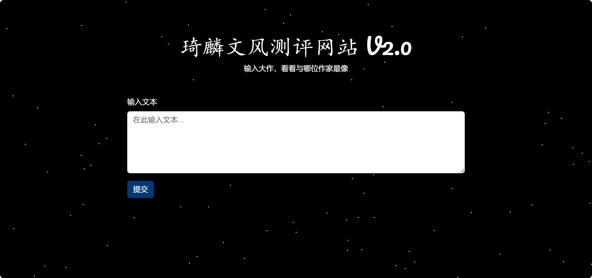
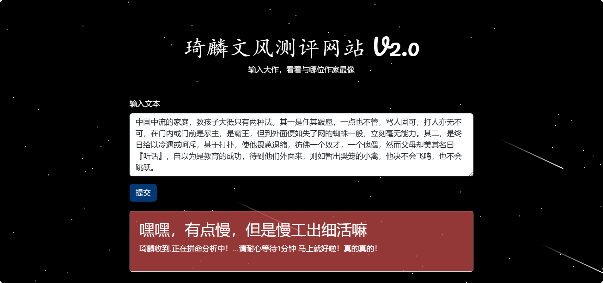

# 琦麟文风测试
#### 许焜琦 陈麟丰
## 网站地址： xkq1qkx.github.io/texture.github.io
## 运行截图

<div align="center">
    
    
    
    
</div>

## 一、主页说明
主页呈现了一个提交用户文字的对话框用以与用户交互，背景是夜空中繁星点点闪烁，并时不时窜过几道流星。含义是，在人类群星闪耀时，我们应珍惜并记录下前人的每一笔珍贵的文字财富。
### HTML部分
头部：包含字符编码、视口设置、标题、CSS和JavaScript引入
引入url实现特殊字体
主体：
一个背景为星空效果的div，用于展示星星和流星动画
一个容器div，包含标题、描述、输入表单和结果展示框
CSS部分
基础样式：设置页面高度、外边距、溢出、字体等
星空背景：通过position和animation实现星星的闪烁和流星的飞逝效果
表单和结果展示框：设置了背景颜色、边框、填充、边距等
### 主要功能实现
##### 创建星星和流星动画
createStars函数：生成并添加100颗星星到背景中
createMeteors函数：每隔5秒生成并添加4颗流星到背景中，并在动画结束后移除
##### 文本分析功能
获取文本嵌入：getAverageEmbedding函数使用Universal Sentence Encoder模型加载文本并计算其嵌入向量
获取作家数据：fetchWriterData函数从本地JSON文件中获取作家数据
提交处理：handlesubmit函数处理表单提交，获取用户输入的文本，并与作家数据进行相似度比较，最终跳转到结果页面
表单提交与事件绑定
事件绑定：document.getElementById('analyzeForm').addEventListener('submit', handlesubmit)将表单提交事件绑定到handlesubmit函数
##### 注意事项
TensorFlow.js和Universal Sentence Encoder库的加载：需要确保网络连接正常，并且这些库能正确加载
作家数据的获取：fetchWriterData函数从本地的writerdata.json文件获取数据，需要确保该文件存在且路径正确
异2步处理：处理嵌入向量和相似度计算时，采用了异步处理，避免阻塞主线程
结果展示：在计算相似度的过程中，适时更新提示信息，提升用户体验
跳转结果页面：根据相似度最高的作家，跳转到对应的结果页面并传递相关参数
## 二、数据集构建 
### 数据集建立
数据格式举例：
```json
[
    {
        "name": "王开岭",
        "intro": [
            "王开岭，男，1969年出生，山东滕州人。现居北京。作家、媒体人。历任央视《社会记录》《24小时》《看见》等栏目的指导和主编。",
            "著有散文和思想随笔集《精神明亮的人》《古典之殇》《跟随勇敢的心》《精神自治》《激动的舌头》《王开岭作品·中学生典藏版》等十余本书，作品入录国内外数百种优秀作品选。其作品因“清洁的思想、诗性的文字、纯美的灵魂”而在大中学校园拥有广泛影响，入录苏教版高中语文教科书、《新语文课本》和各类中高考语文试题，被誉为中国校园的“精神启蒙书”和“美文鉴赏书”。"
        ],
        "famous":[
            "一个真正热爱自然、值得尊敬的成年人，一定是那种“直至成年依然童心未泯的人”。",
            "向婴儿学习，学习简单、干净、轻盈、率性，学习情不自禁、忘乎所以…… 向狂野学习，学习激情、独白，学习无技术的动作和经验之外的常识…",
            "没有雪的冬天，还有季节的尊严吗",
            "我们唱了一路的歌，却发现无词无曲。 我们走了很远很累，却忘了为何出发。",
            "对少年心理有着诱惑和塑造功能的并非课本，而是成人世界的生活模型和价值面貌。"
        ],
        "articles": [
            "高楼大厦夺走了地平线，灰蒙蒙的尘霾，空气中老有油乎乎的腻感，挥之不散的汽油味，即使你捂起了耳朵，也挡不住车流的喇叭，没有旷野远山，没有庄稼地，只有牛角一样粗硬的黑水泥和钢化砖。所有的景色，所有的目击物，皆无施洗过的那种鲜艳和亮泽、那抹蔬菜般的翠绿与寂静……你意识不到一种“新”，察觉不到婴儿醒时的那种清新与好奇，即使你大睁着眼，仍觉得在昏沉的睡雾中。",
            "巴尔扎克说：傻瓜旁边必有骗子。法学家也说：在骗子眼里，除了同行，天下皆傻瓜-这是他们最大的职业依据，也是信仰所在。我就寻思，你说这世上是先有傻瓜还是先有骗子？是骗子证明了傻瓜还是傻瓜激励着骗子呢？当骗子和傻瓜都越来越多，更大的疑惑来了：这是个以骗子命名的年代，还是个用傻瓜注册的年头？这是场考验纯真的精神游戏，还是智商博弈的丛林肉战？那传说中的裁判在哪呢？还是压根就没有？",
            "世上有些墓地，虽巍峨，却缺乏自由感和生命性，法老的金字塔、中国的帝王陵……凸起的都太夸张、太坚硬，硕大的体积，捆着一团空荡荡的腐气，太具物质的膨胀力，太具侵略性和彰显欲望。总之，有一种疏远尘世的味道，虽威风凛凛，却远离了人间体息和泥土亲情，一点不像生命栖息的地儿，反倒是给人落下个印象，那人的的确确熄灭了。",
            "应该说，半世纪之前的人类，在对星空的消费上，基本是一种纯真的、童年式的文化和精神消费，更多地，人们用一种唯美和宗教的视线凝望它。但现代以来，随着技术野心的膨胀和飞行工具的扩张，人们变得实用了、贪婪了，开始以一种急躁的物理的方式染指她……手足代之目光，触摸代之表白。这有个标志点：公元1969年7月20日，随着“阿波罗”登月舱缓缓启开，一个叫阿姆斯特朗的地球人，在一片人类从未涉足过的裸土上，插下了一面星条旗。"
        ]
    }
]
```
### 基于数据集计算匹配度算法
##### 文本嵌入 余弦相似度
使用TensorFlow.js加载Universal Sentence Encoder模型，并使用该模型计算文本的嵌入向量。
使用余弦相似度与数据集中的作家文字生成的平均嵌入比对，得出嵌入向量之间的相似度。
根据相似度对计算结果排序，找到与输入文本最匹配的作家。
##### 结果展示
将匹配结果展示给用户，包括作家的姓名、匹配度、照片、简介和名言。

## 三、测试结果页面
在index.html中，完成输入并点击提交后，通过匹配算法，得到与输入文字最相近的作家编号与匹配度。接下来，网页会跳转到222.html界面。以下说明均指222.html中的代码内容。
##### 标题和引用
第5至7行和第11行引用了外部url，以便后续可以使用自定义的字体和动画。
##### css样式
第10至227行，是通过css实现的样式部分，其中：
第13至21行定义了body和html 的样式。
第23至47行定义了星空背景starry-background的样式，以及星星闪烁的相关参数，与index.html相同。
第49至69行定义了烟花firework的格式参数与移动范围launch，从初始位置开始，在y轴向上移动固定的600px。
第71至90行定义了烟花爆炸explosion的参数。每颗爆炸碎片相对原本升空的烟花，直径更小，颜色更明亮。初始位置为爆炸的位置，即升空的终点，x轴偏移量为0，y轴偏移量为-600px。explosion类型具有x、y两个参数，代表从爆炸起点需要运行的x、y距离。
第92至96行定义了渐变色背景。
第98至108行定义了modal类型，该类型用于展示文字，占据页面80%的宽度和100vh的高度。通过事先设置max-height，并启动自动overflow实现滚动显示文字。
第110至145行定义了作家信息的属性。作家的姓名、匹配度、照片、简介和名言各自具有不同的id，方便后续通过查找id定位。同时设置了文字的字体、大小等属性。
第147至159行定义了文字的属性。标题和内容使用的文字大小和间距有所不同。
第160至226行定义了按钮的属性，包括将鼠标悬停在按钮上，会产生的颜色变化效果等。
##### html页面
第231至252行，是通过html实现的页面行为部分，其中：
第231行放置了星空背景。
第234至239行展示匹配的作家姓名和匹配度
第240行至247行放置再测一次和跳转到简介页面的按钮。
第248至251行放置作家简介和名言的文字。
##### javascript控制背景
第254至315行，是通过javascript实现的背景部分，其中：
第256至265行创建星星，方法与index中的一致。
第267至288行定义烟花函数，方式为：每过3秒，在页面的左侧30%和右侧30%部分随机生成一颗烟花。烟花的起始位置如下：x坐标为上述范围的任意位置，y坐标为80%至120%之间的任意位置。烟花生成的位置可能在页面之外，因为飞行距离较长，可以飞到页面内。随后，烟花在2秒内沿着y轴向上飞行600px（y方向偏移量-600px）。2秒后，飞行到达目的地，烟花爆炸，向爆炸函数传入位置信息，并从背景上回收烟花。
第290至312行定义爆炸函数，方式为：接收到爆炸位置后，以该位置为中心，生成36颗碎片（类型为explosion），并生成爆炸范围sz，该值为100px至300px之间的随机数。每颗碎片的偏转角为0-360°均匀排列，根据偏转角计算其终点在x、y轴上的偏移量，并通过setProperty函数将其传入碎片的属性，最后将碎片放置在背景上。2秒后，爆炸结束，回收所有碎片。
##### javascript控制监听与接收信息
第317至376行，是通过javascript实现的监听部分，其中：
第319至323行，接收匹配算法返回的作家编号和匹配度，并存储在submittedid和acc_ans中。通过Math.floor函数使得acc_ans能够保留四位有效数字。
第328至334行，从数据库writerdata.json中获取全部作家数据data，并将对应的作家数据通过submittedid提取出来，赋给变量writer。
第343至350行，通过监听鼠标悬停和点击事件，为按钮添加返回首页或者跳转到网页搜索的行为。
第352至371行，通过getElementById函数，将html中具有对应id（姓名、匹配度、照片、简介、名言）的div定位出来，并将数据中相应的文字信息，或者image文件夹中相应的照片链接加入container。
整体上，这部分实现的是根据submittedid和acc_ans，从数据库中定位到并展示相应的信息。
